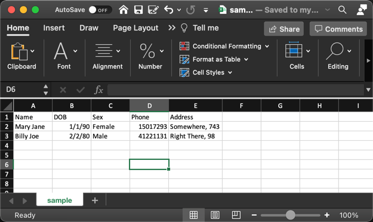
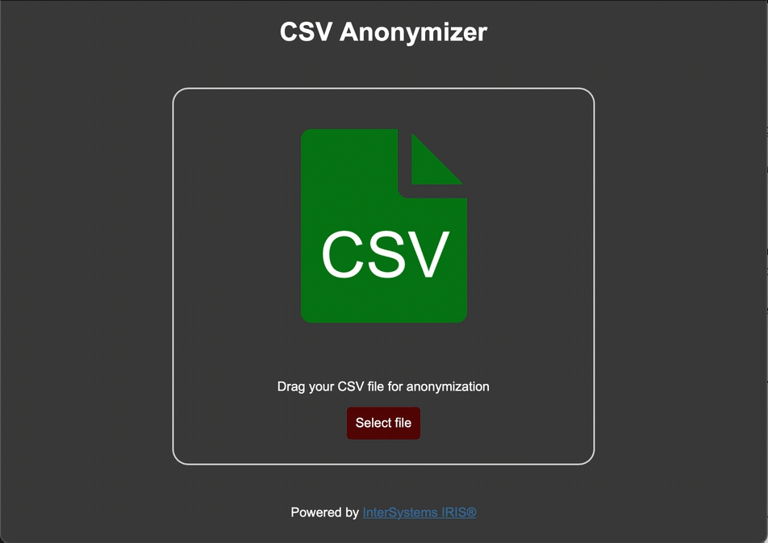
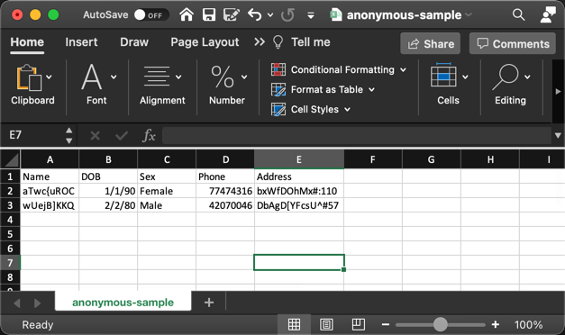

# CSV Anonymizer Powered by InterSystems IRIS®

Tiny web application that allows you to anonymize CSV files. Based on [InterSystems IRIS®](https://www.intersystems.com/products/intersystems-iris)

## Application

Sample CSV where Date of Birth and Sex will remain untouched, while the rest should be anonymized.

The application recognizes the header columns and allows the user to chose which ones to ignore.

After processing.

## Setup

**Make sure you have Docker up and running before starting.**

Clone the repo `git clone https://github.com/OneLastTry/iris-csv-anonymizer.git` and then execute from the main directory `docker-compose build`.
_(for arm64 run `docker-compose --env-file=.env-arm64 build`)_

## Execution

Once the build is complete, from the main directory, start your iris container:

- **start container:** `docker-compose up -d`

## Access

You can now access the application via [http://localhost:8092/appl/Anonymizer.Web.Application.zen](http://localhost:8092/appl/Anonymizer.Web.Application.zen)
